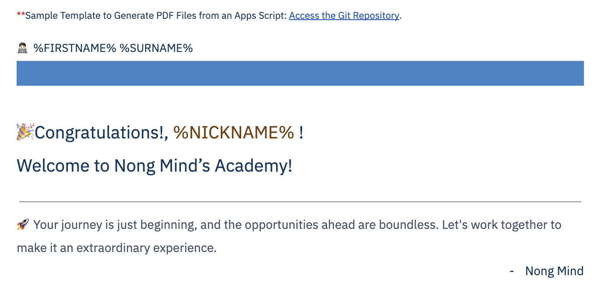
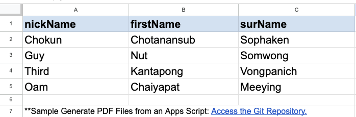
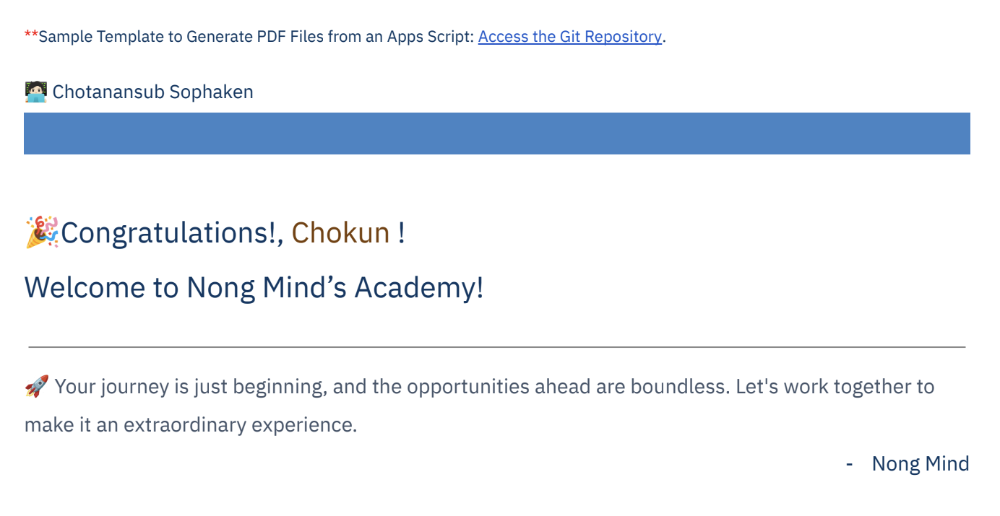
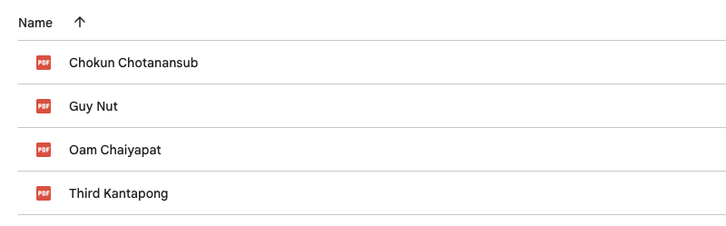

# 📝 Template-to-PDFs

- 💡 This is the Apps Script module for generating PDF files from a Google Docs template and retrieving values in order from a Google Sheet.

- The script, [template_to_pdf.gs](template_to_pdf.gs) , is a versatile general form template. 

- For a better understanding of its functionality you can quickly review the [sample_task](sample_task) folder to see an example of script implementation

## Demo

### Template: 

---

### Data: 

---

### Output: 

## Credit
- The inspiration and guidance for this project came from the YouTube tutorial [PDFs from Spreadsheet Data and Google Docs Template - Learn Google Sheets & Excel Spreadsheets](https://www.youtube.com/watch?v=r9uU_KwGgzQ&t=1466s) by [Learn Google Sheets & Excel Spreadsheets].
